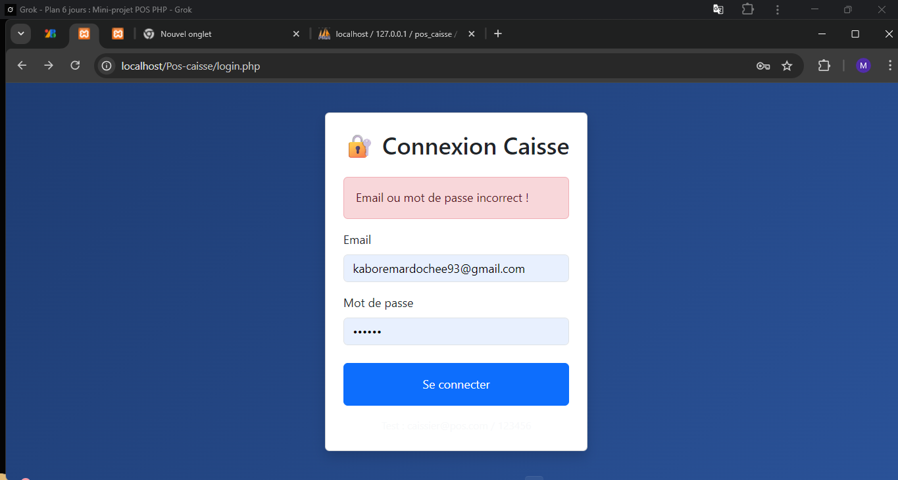
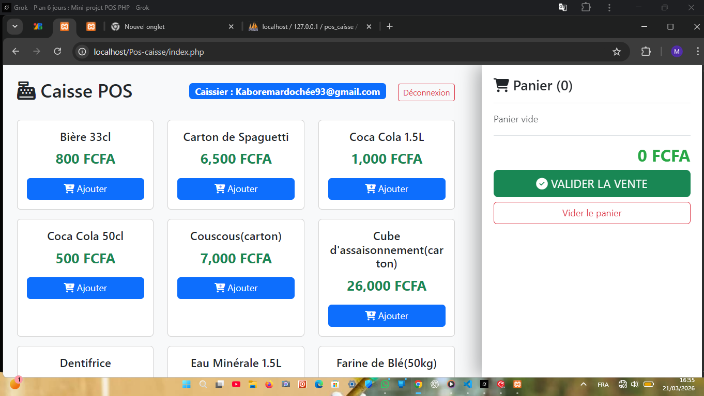
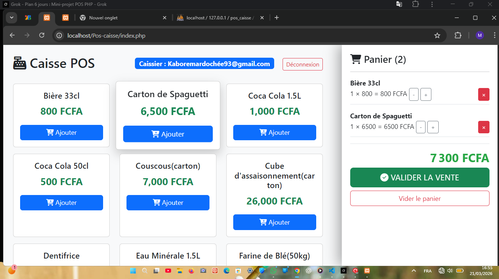
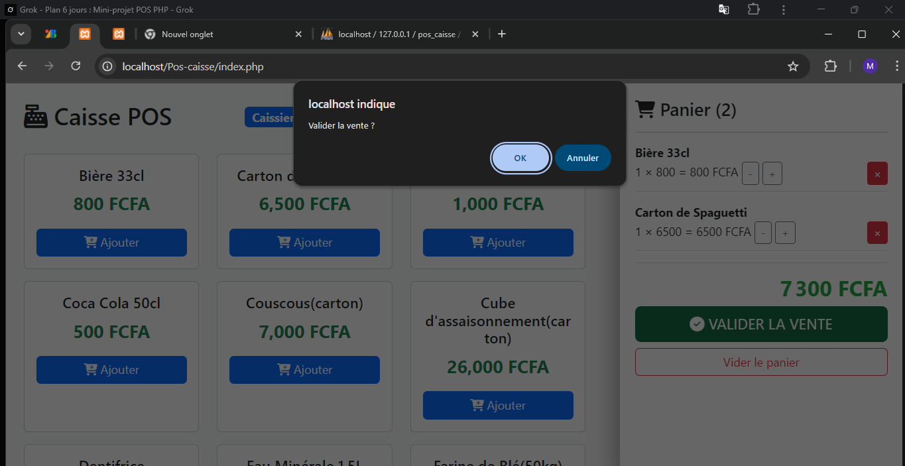
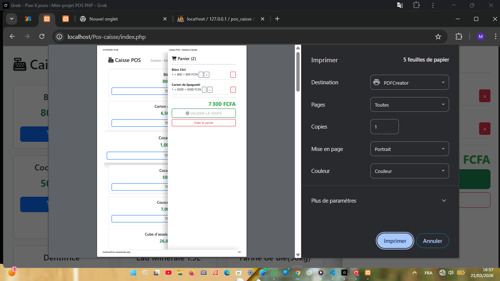
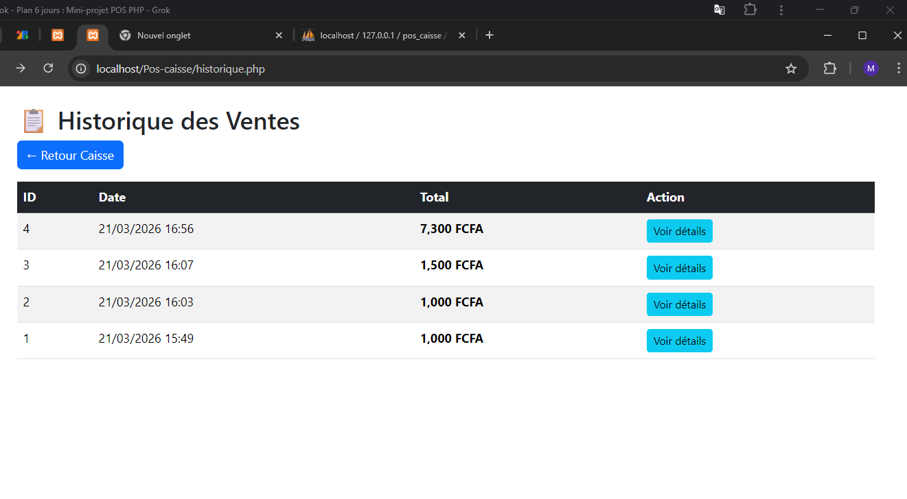
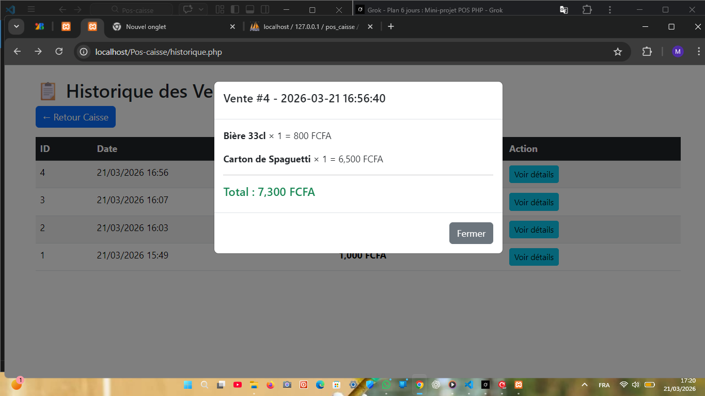
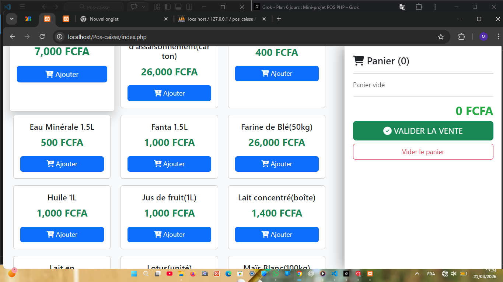

# Application Web de Gestion de Caisse (POS)

## Binôme
- KABORE Mardochée
- KABORE Alassane

## Technologies utilisées
- PHP + MySQL
- Bootstrap 5
- Sessions PHP (panier)
- Git & GitHub

## Fonctionnalités réalisées
- Connexion / Déconnexion
- Interface caisse moderne
- Panier dynamique (ajouter, modifier, supprimer)
- Calcul automatique du total
- Enregistrement des ventes (tables `ventes` + `vente_details`)
- Historique des ventes avec détails (modal)
- Reçu imprimable

## Installation
1. Mettre le dossier dans `htdocs`
2. Importer la base `pos_caisse` (script SQL fourni)
3. Accéder à `http://localhost/Pos-caisse/login.php`
   - Email : caissier@pos.com
   - Mot de passe : 123456

## Captures d'écran

### 1. Page de Connexion!

### 2. Interface Caisse (panier vide)

### 3. Panier rempli + Total automatique

### 4. Validation de vente

### 5. Reçu imprimé

### 6. Historique des ventes

### 7. Détaille vente

### 8. Page avec produit modifié

## Liens
- GitHub : https://github.com/kaboremardochee93-hue/Pos-caisse
- Trello : https://trello.com/invite/b/69bbf837bffeb7b7499e8df0/ATTI28aeb6d9a65427f23d6533f844d38f08AF8AA7C0/gestion-caisse-pos
- Cahier des charges : https://docs.google.com/document/d/1H-oLTOiegz8EqdeaDF7T8CcdfhzL7j0eT8Hq9JQUvC0/edit?usp=sharing 